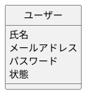

# データモデル

## 論理 ERD

```plantuml
@startuml

' hide the spot
hide circle

' avoid problems with angled crows feet
skinparam linetype ortho

entity "ユーザー" as user {
  氏名
  メールアドレス
  パスワード
  状態
}

' 関連

@enduml
```
